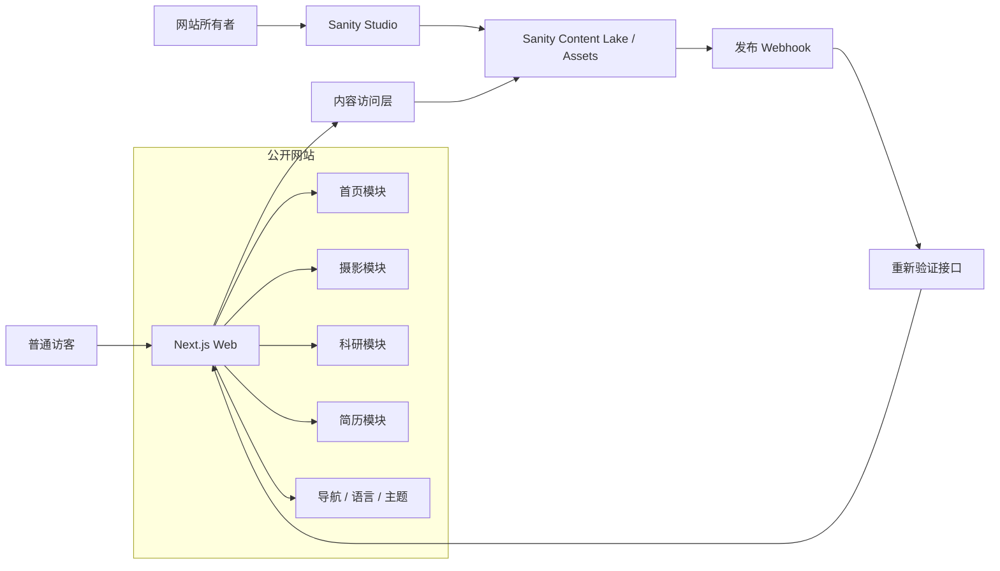
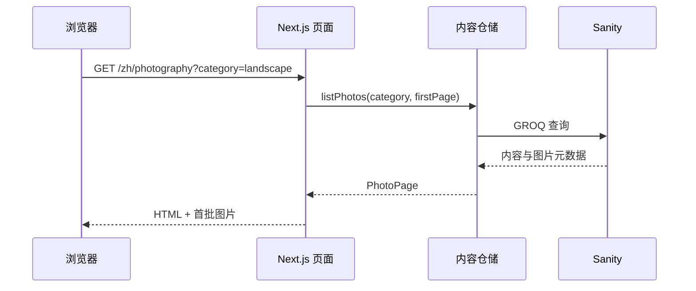
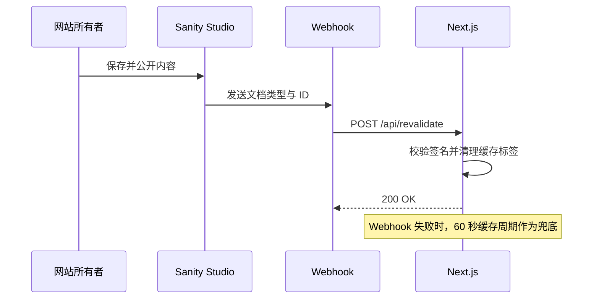
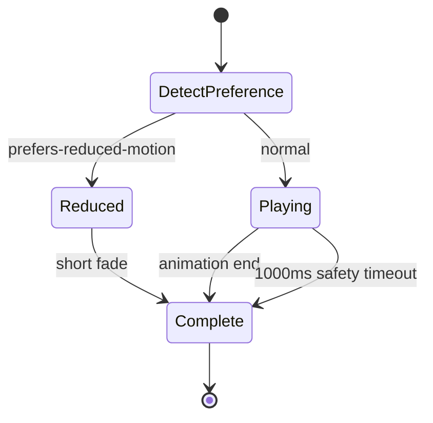
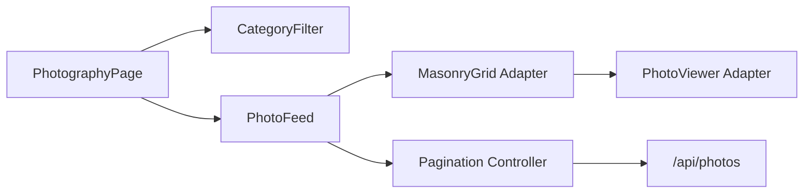
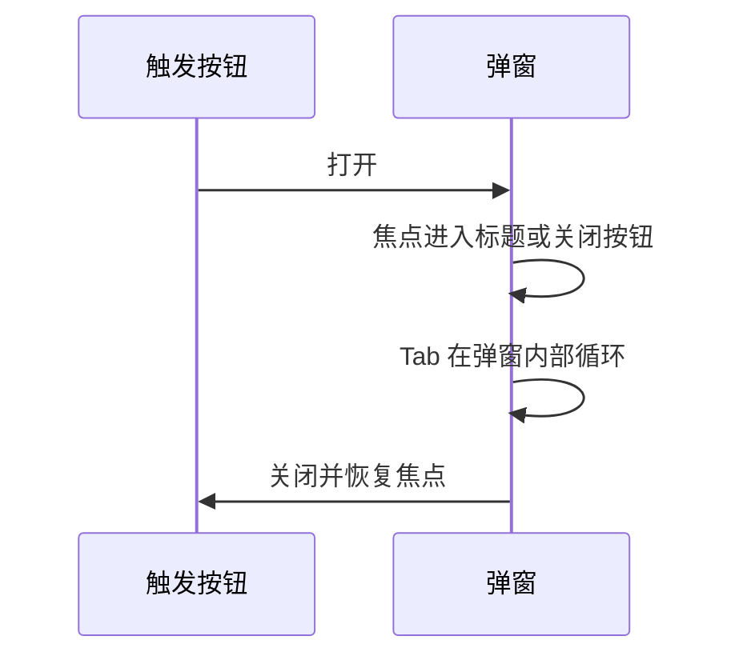
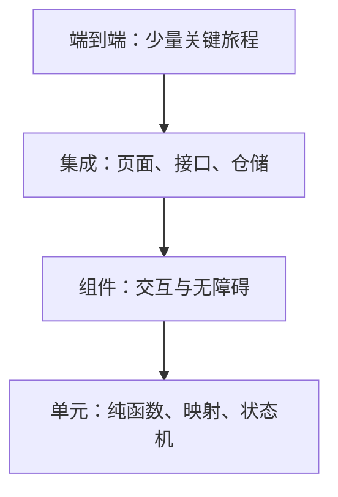
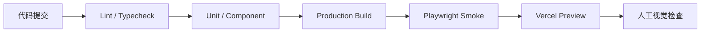

# 个人作品网站详细设计文档

> 项目代号：风花诗酒茶个人网站  
> 文档版本：v1.0  
> 文档日期：2026-07-27  
> 上游文档：[proposal.md](./proposal.md)  
> 当前状态：详细设计完成，可用于任务拆分、开发与测试

## 1. 文档目的

本文将需求文档转化为可实施、可独立测试的技术设计，明确：

- 系统架构与技术边界；
- 页面、领域模块与基础设施模块；
- 模块公开接口、依赖方向及失败策略；
- Sanity 内容模型与查询方式；
- 摄影分页、弹窗、国际化、主题和动画状态设计；
- 测试分层、验收追踪和部署方案。

本设计只覆盖开发预览阶段。正式域名、ICP 备案和中国大陆生产部署保留为后续架构决策，不影响当前模块开发。

## 2. 设计目标与原则

### 2.1 设计目标

1. 约 100 张摄影作品可以渐进加载，不阻塞首页或摄影页首屏。
2. 内容、展示和外部 CMS 解耦，未来更换内容平台时无需重写页面组件。
3. 中文、英文、深色和浅色均由统一基础设施支持，业务模块不重复实现。
4. 摄影查看器与科研项目弹窗互相独立，可分别开发和测试。
5. 管理后台与公开页面共享数据约束，避免后台可保存、前台却无法渲染的数据。
6. 所有外部依赖均通过适配器访问，单元测试不连接真实 Sanity 或网络。

### 2.2 模块化原则

- **单向依赖**：页面组合模块依赖领域模块，领域模块依赖公开契约，不反向依赖页面。
- **接口优先**：页面只调用仓储接口，不直接编写 GROQ 查询。
- **无共享可变状态**：语言、主题、弹窗状态分别管理，不建立全局大状态库。
- **服务端优先**：初始内容在服务端获取；只有弹窗、筛选、加载更多和切换按钮使用客户端组件。
- **渐进增强**：动画或 JavaScript 失败时，核心内容和链接仍可访问。
- **可替换依赖**：瀑布流、Lightbox、Dialog 等第三方组件包在本地适配器中，不散落到页面代码。

## 3. 技术基线

| 类别 | 选型 | 用途 |
| --- | --- | --- |
| 语言 | TypeScript | 前端、服务端路由、CMS Schema 与测试 |
| Web 框架 | Next.js App Router | 路由、服务端渲染、缓存、图片和 Route Handler |
| UI | React | 组件与交互状态 |
| 样式 | Tailwind CSS + CSS 自定义属性 | 响应式、主题 Token 与局部复杂样式 |
| 动画 | Motion | 开场、滚动出现、弹窗过渡 |
| 国际化 | next-intl | URL 语言、界面文案与格式化 |
| 主题 | next-themes | 系统主题、手动覆盖和持久化 |
| CMS | Sanity Studio / Content Lake | 浏览器后台、结构化内容、图片和 PDF |
| 瀑布流 | React Photo Album 的本地适配层 | 响应式图片排布 |
| 摄影查看器 | Yet Another React Lightbox 的本地适配层 | 放大、缩放、键盘与触摸切换 |
| 对话框 | Radix Dialog 或同等无障碍组件 | 科研项目居中弹窗 |
| 单元/组件测试 | Vitest + Testing Library | 纯函数、Hook 与组件行为 |
| 接口模拟 | MSW | 模拟内容仓储与 Route Handler |
| 端到端测试 | Playwright | 跨页面、设备和键盘操作 |
| 无障碍测试 | axe-core | 自动检查常见可访问性问题 |
| 预览部署 | Vercel | 开发预览地址与自动部署 |

依赖版本在项目初始化时锁定为当时稳定版本。第三方库不得直接成为领域模型的一部分。

## 4. 总体架构



### 4.1 运行时边界

1. **公开网站**：Next.js 应用，负责页面渲染和访客交互。
2. **管理后台**：Sanity Studio，只允许网站所有者登录。
3. **内容服务**：Sanity Content Lake 与 Asset CDN。
4. **内容刷新接口**：接收 Sanity Webhook，按内容类型清理缓存标签。
5. **摄影分页接口**：为浏览器端“加载更多”提供稳定、可测试的 JSON 契约。

### 4.2 数据流

#### 页面首次访问



#### 后台内容更新



## 5. 代码组织

推荐采用单一 Next.js 应用和功能目录。Sanity Studio 作为同一仓库内的独立路由与配置存在，共享内容 Schema，但不进入公开页面业务组件。

```text
src/
├── app/
│   ├── [locale]/
│   │   ├── layout.tsx
│   │   ├── page.tsx
│   │   ├── photography/page.tsx
│   │   ├── research/page.tsx
│   │   └── resume/page.tsx
│   ├── api/
│   │   ├── photos/route.ts
│   │   └── revalidate/route.ts
│   └── studio/[[...tool]]/page.tsx
├── features/
│   ├── home/
│   ├── photography/
│   ├── research/
│   ├── resume/
│   ├── contact/
│   ├── intro-animation/
│   ├── locale/
│   └── theme/
├── components/
│   ├── layout/
│   ├── ui/
│   └── feedback/
├── content/
│   ├── contracts/
│   ├── repositories/
│   ├── sanity/
│   └── mappers/
├── config/
├── i18n/
├── lib/
└── styles/

sanity/
├── schemaTypes/
├── structure/
├── actions/
└── sanity.config.ts

tests/
├── unit/
├── integration/
├── e2e/
├── fixtures/
└── visual/
```

### 5.1 依赖规则

```text
app -> features -> content/contracts
app -> components
features -> components
content/repositories -> content/mappers -> content/contracts
content/sanity -> Sanity SDK
sanity/schemaTypes -> shared validation constants
```

禁止的依赖：

- `components/ui` 不得导入任何具体业务模块；
- `features/photography` 不得导入 `features/research`；
- 页面和业务组件不得直接导入 Sanity Client 或 GROQ 查询；
- Sanity 原始文档类型不得直接传入 React 组件；
- 主题和语言模块不得读取或修改摄影、科研状态。

## 6. 路由设计

| URL | 页面 | 渲染方式 | 说明 |
| --- | --- | --- | --- |
| `/` | 语言入口 | Redirect | 重定向到 `/zh` |
| `/zh`、`/en` | 首页 | Server + Client Islands | 默认中文；含开场动画 |
| `/zh/photography`、`/en/photography` | 摄影作品 | Server + Client | 分类、分页、Lightbox |
| `/zh/research`、`/en/research` | 科研成果 | Server + Client | 列表与居中弹窗 |
| `/zh/resume`、`/en/resume` | 个人简历 | Server | 教育、获奖与 PDF |
| `/zh#contact`、`/en#contact` | 联系方式 | 首页锚点 | 不增加独立页面 |
| `/studio` | 内容后台 | Client Tool | Sanity 身份验证保护 |
| `/api/photos` | 摄影分页 API | Route Handler | 只读公开接口 |
| `/api/revalidate` | 内容刷新 API | Route Handler | 仅接受签名 Webhook |

语言切换通过替换 URL 第一段实现，保留路径、查询参数和锚点。例如：

```text
/zh/photography?category=portrait#gallery
-> /en/photography?category=portrait#gallery
```

## 7. 共享领域契约

公开页面只使用经过映射和校验的领域对象。

```ts
export type Locale = 'zh' | 'en';
export type ThemeMode = 'light' | 'dark' | 'system';
export type PhotoCategory = 'landscape' | 'portrait';

export interface LocalizedText {
  zh: string;
  en: string;
}

export interface ImageAsset {
  id: string;
  width: number;
  height: number;
  aspectRatio: number;
  blurDataUrl?: string;
  alt: LocalizedText;
}

export interface Profile {
  nickname: string;
  avatar: ImageAsset;
  bio: LocalizedText;
  institution: string;
  role: LocalizedText;
  email: string;
  heroPhotoId: string;
  resumeUrl: string;
}

export interface EducationEntry {
  id: string;
  institution: LocalizedText;
  description: LocalizedText;
  period: string;
  order: number;
}

export interface AwardEntry {
  id: string;
  title: LocalizedText;
  date: string;
  description?: LocalizedText;
  order: number;
}

export interface Photo {
  id: string;
  image: ImageAsset;
  categories: PhotoCategory[];
  shotAt: string; // YYYY-MM
  city: LocalizedText;
  description: LocalizedText;
  featured: boolean;
  featuredOrder?: number;
}

export interface PaperResult {
  id: string;
  title: LocalizedText;
}

export interface ResearchProject {
  id: string;
  title: LocalizedText;
  period: string;
  summary: LocalizedText;
  images: ImageAsset[];
  papers: PaperResult[];
  featured: boolean;
  featuredOrder?: number;
}

export interface PageResult<T> {
  items: T[];
  nextCursor: string | null;
  hasMore: boolean;
}
```

### 7.1 契约约束

- `LocalizedText.zh` 与 `LocalizedText.en` 均不得为空。
- `ImageAsset.width`、`height` 必须大于 0，以便预留布局空间。
- `Photo.shotAt` 必须满足 `YYYY-MM`。
- `Photo.categories` 至少包含一项且不得包含未知值。
- 全站精选照片不得超过 5 张。
- 首页精选科研项目不得超过 3 个。
- `ResearchProject.images` 长度为 1 至 3。
- PDF URL 必须来自允许的 Sanity Asset 域名。

运行时在内容映射层进行防御性校验。非法文档写入结构化日志，并从页面结果中排除，避免单条坏数据导致整页失败。

## 8. 内容访问模块

### 8.1 职责

- 封装 Sanity Client 和 GROQ 查询；
- 将 CMS 原始文档转换为领域对象；
- 管理缓存标签与 60 秒兜底刷新；
- 为单元测试提供内存仓储替身；
- 隔离页面代码与 Sanity 特有字段。

### 8.2 公开接口

```ts
export interface ProfileRepository {
  getProfile(): Promise<Profile>;
  listEducation(): Promise<EducationEntry[]>;
  listAwards(): Promise<AwardEntry[]>;
}

export interface PhotoRepository {
  getHeroPhoto(): Promise<Photo>;
  listFeatured(limit: 5): Promise<Photo[]>;
  listPage(input: {
    category: PhotoCategory;
    cursor?: string;
    limit: number;
  }): Promise<PageResult<Photo>>;
}

export interface ResearchRepository {
  listFeatured(limit: 3): Promise<ResearchProject[]>;
  listAll(): Promise<ResearchProject[]>;
  getById(id: string): Promise<ResearchProject | null>;
}
```

### 8.3 缓存标签

| 内容类型 | 缓存标签 |
| --- | --- |
| `profile` | `profile` |
| `education` | `education`, `resume` |
| `award` | `awards`, `resume` |
| `photo` | `photos`, `home` |
| `researchProject` | `research`, `home` |

所有内容读取设置最多 60 秒的兜底缓存周期。Webhook 正常时按标签即时刷新；Webhook 失败时不超过一个缓存周期恢复一致。

### 8.4 错误策略

| 场景 | 行为 |
| --- | --- |
| CMS 短暂不可用且有缓存 | 返回上次成功内容 |
| CMS 不可用且无缓存 | 页面显示模块级错误状态，不暴露内部错误 |
| 单条文档字段非法 | 排除该条并记录错误 |
| 首页主图缺失 | 使用精选照片第一张；仍缺失则显示纯色首屏 |
| PDF 缺失 | 隐藏下载按钮并显示双语暂不可用提示 |

### 8.5 独立测试

- 使用固定 CMS 原始数据验证映射结果；
- 验证空字段、错误年月、未知分类和缺失图片被拒绝；
- 验证查询排序与分页游标；
- 使用内存仓储替代 Sanity，页面测试不访问网络；
- 模拟 CMS 失败，验证缓存和模块级错误策略。

## 9. 内容管理后台模块

### 9.1 职责

- 提供单用户浏览器后台；
- 定义内容 Schema、字段说明和校验；
- 支持图片焦点、PDF 上传和排序字段；
- 提供“保存并公开”操作；
- 发布后调用内容刷新 Webhook。

### 9.2 后台结构

```text
内容管理
├── 个人资料（单例）
├── 教育经历
├── 获奖经历
├── 摄影作品
└── 科研项目
```

### 9.3 文档级校验

| 文档 | 校验 |
| --- | --- |
| 个人资料 | 单例；中英文简介、头像、邮箱、学校、身份和主图必填；简历仅 PDF |
| 教育经历 | 中英文机构和说明必填；排序为非负整数 |
| 获奖经历 | 中英文名称与时间必填 |
| 摄影作品 | 图片必填；替代文本、分类、年月、城市和介绍均选填，支持在后台批量上传 |
| 科研项目 | 双语名称和简介必填；图片 1 至 3 张；论文名称列表合法 |

跨文档数量限制通过异步校验实现：

- 将照片设为精选前，查询其他精选照片，合计不得超过 5；
- 将科研项目设为首页精选前，查询其他精选项目，合计不得超过 3；
- 精选顺序在同类文档中不得重复。

### 9.4 发布行为

后台将默认操作简化为“保存并公开”：

1. 执行字段与跨文档校验；
2. 校验通过后发布文档；
3. Sanity 发送签名 Webhook；
4. 前台按标签清除缓存；
5. 后台显示成功或失败反馈。

不提供独立内容审核、预约发布和公开预览流程。Sanity 内部历史能力可用于误删恢复，但不作为日常发布步骤。

### 9.5 独立测试

- Schema 单元测试：必填、格式、数量上限和 PDF 类型；
- 自定义发布动作测试：校验失败不发布，成功后发布；
- Webhook 合约测试：发送的文档类型和 ID 正确；
- 使用测试数据集执行后台冒烟测试；
- 确认未登录用户无法进入 Studio 或执行写入。

## 10. 应用外壳与导航模块

### 10.1 职责

- 渲染桌面导航和移动菜单；
- 提供首页、摄影、科研、简历、联系方式入口；
- 承载语言与主题开关；
- 管理跳过导航链接、当前页状态和移动菜单焦点。

### 10.2 接口

```ts
interface NavigationItem {
  key: 'home' | 'photography' | 'research' | 'resume' | 'contact';
  href: string;
  label: string;
}

interface AppShellProps {
  locale: Locale;
  navigation: NavigationItem[];
  children: React.ReactNode;
}
```

### 10.3 状态

- `mobileMenuOpen: boolean` 只存在于导航组件内部；
- 页面切换后自动关闭移动菜单；
- 打开菜单时将焦点移入菜单，关闭后返回菜单按钮；
- Esc 关闭移动菜单。

### 10.4 独立测试

- 桌面与移动断点下入口完整；
- 当前页面具有可访问状态；
- 联系方式入口正确跳到本语言首页 `#contact`；
- 键盘可以打开、遍历和关闭移动菜单；
- 语言与主题开关可用，但各自行为由对应模块测试。

## 11. 国际化模块

### 11.1 职责

- 校验 URL 语言；
- 默认将 `/` 重定向到 `/zh`；
- 加载界面消息字典；
- 从双语领域字段中选择当前语言内容；
- 切换语言时保留路径、查询参数与锚点。

### 11.2 设计

界面文案保存在代码字典：

```text
src/i18n/messages/zh.json
src/i18n/messages/en.json
```

业务内容保存在 Sanity 双语字段中。二者不可混用：按钮和错误提示不进入 CMS，个人内容不硬编码到消息字典。

```ts
export function localize(
  value: LocalizedText,
  locale: Locale,
): string {
  return value[locale];
}
```

### 11.3 缺失内容策略

- CMS 发布校验阻止缺失中文或英文内容；
- 运行时发现缺失时显示该语言的“内容暂不可用”，不自动机器翻译；
- 开发和测试环境同时记录缺失字段路径。

### 11.4 独立测试

- `/` 重定向 `/zh`；
- 不支持的语言返回 404；
- 中英文消息键完全一致；
- 语言切换保留摄影分类、当前路径和锚点；
- CMS 双语字段正确选择且不会串语言。

## 12. 主题模块

### 12.1 职责

- 首次访问读取系统主题；
- 支持用户手动选择浅色或深色；
- 将手动选择写入本地存储；
- 避免服务端与客户端主题不一致造成闪烁；
- 为业务组件提供语义化颜色 Token。

### 12.2 Token 设计

业务组件只使用语义 Token，不直接写死颜色：

```css
:root {
  --color-bg: ...;
  --color-surface: ...;
  --color-text: ...;
  --color-text-muted: ...;
  --color-border: ...;
  --color-accent: ...;
  --color-overlay: ...;
  --shadow-dialog: ...;
}

[data-theme='dark'] {
  /* 同名 Token 的深色值 */
}
```

摄影图片容器不设置改变图片颜色的 `filter`、混合模式或全局透明度。

### 12.3 独立测试

- 无持久化值时跟随 `prefers-color-scheme`；
- 手动切换后写入本地存储；
- 刷新后保留选择；
- 系统主题变化只影响仍处于 `system` 的用户；
- 首屏没有明显的错误主题闪烁；
- 两套主题通过对比度自动检查。

## 13. 开场动画模块

### 13.1 职责

- 每次进入首页时播放最多 1 秒的开场；
- 动画期间不阻塞页面数据获取；
- 支持减少动态效果和低能力设备降级；
- 完成后卸载覆盖层，避免长期占用交互层。

### 13.2 状态机



### 13.3 实现约束

- 覆盖层只使用轻量 DOM、CSS 和 Motion 变换，不加载视频或 3D 引擎；
- 主要使用 `transform` 与 `opacity`，避免持续触发布局；
- 页面内容在覆盖层下方已完成渲染；
- 安全计时器在 1000ms 时强制结束；
- 减少动态效果模式只进行极短淡入；
- 组件只在首页挂载，离开首页即销毁。

### 13.4 独立测试

- 正常模式在 1000ms 内结束；
- 动画回调未触发时安全计时器仍结束覆盖层；
- 减少动态效果时不运行位移动画；
- 动画期间页面不会触发重复数据请求；
- 组件卸载后计时器得到清理；
- 禁用 JavaScript 时首页正文仍存在于服务端 HTML。

## 14. 首页模块

### 14.1 职责

- 组合首屏、个人介绍、5 张精选摄影、3 个精选科研、简历摘要和联系方式；
- 并行获取各区块数据；
- 对非关键区块使用独立加载和错误边界；
- 应用统一滚动出现效果，但不拥有语言或主题状态。

### 14.2 组件结构

```text
HomePage
├── IntroAnimation
├── HeroSection
├── ProfileSection
├── FeaturedPhotoSection
├── FeaturedResearchSection
├── ResumeSummarySection
└── ContactSection
```

### 14.3 数据获取

```ts
const [profile, hero, photos, projects, education, awards] =
  await Promise.all([
    profileRepository.getProfile(),
    photoRepository.getHeroPhoto(),
    photoRepository.listFeatured(5),
    researchRepository.listFeatured(3),
    profileRepository.listEducation(),
    profileRepository.listAwards(),
  ]);
```

各区块通过只读 Props 接收数据，不自行查询 CMS。精选摄影卡片可打开摄影查看器；精选科研卡片可打开同一个科研弹窗组件。

### 14.4 错误隔离

- Hero 缺图时使用主题背景和文字继续展示；
- 精选摄影失败只隐藏摄影区并显示轻量错误提示；
- 科研失败不影响简历和联系方式；
- 个人资料失败时保留导航及可配置的静态错误页；
- 所有错误均提供中英文消息。

### 14.5 独立测试

- 使用六个内存仓储结果验证区块组合；
- 精选照片严格为 5 张以内，科研项目严格为 3 个以内；
- 各仓储调用并行且只调用一次；
- 任一区块失败不导致其他区块消失；
- 首页锚点和导航入口一致；
- 三种设备宽度下布局快照通过。

## 15. 摄影模块

摄影模块由相互独立的分类筛选、分页数据源、瀑布流和大图查看器组成。

### 15.1 子模块边界



### 15.2 分类筛选

- URL 查询参数是分类的唯一可信状态：`?category=landscape|portrait`；
- 缺失或非法参数时使用 `landscape`；
- 切换分类触发新页面数据加载并滚动到画廊标题；
- 浏览器前进和后退能恢复分类；
- 中英文使用相同枚举值，只翻译显示标签。

### 15.3 分页接口

#### 请求

```http
GET /api/photos?category=landscape&cursor=<opaque>&locale=zh
```

| 参数 | 规则 |
| --- | --- |
| `category` | 必填；`landscape` 或 `portrait` |
| `cursor` | 可选；服务端生成的不透明游标 |
| `locale` | 必填；`zh` 或 `en` |

#### 成功响应

```json
{
  "items": [],
  "nextCursor": "opaque-or-null",
  "hasMore": true
}
```

#### 错误响应

| 状态 | 场景 |
| --- | --- |
| 400 | 参数或游标非法 |
| 429 | 请求频率异常 |
| 500 | 内容服务不可用且无缓存 |

接口不返回写入凭据或 CMS 内部草稿字段。

### 15.4 分页与排序

- 建议每批 20 张，首屏批次也使用相同上限；
- 精选照片按 `featuredOrder` 升序；
- 其余照片按 `shotAt` 降序，再按文档 ID 稳定排序；
- 游标编码排序键和 ID，不向客户端暴露查询语句；
- 新批次按 ID 去重后追加；
- `hasMore=false` 后停止观察加载哨兵；
- 加载失败保留已有照片并显示“重试”按钮。

### 15.5 瀑布流适配器

```ts
interface MasonryGalleryProps {
  photos: Photo[];
  locale: Locale;
  onOpen: (photoId: string) => void;
}
```

适配器负责把领域 `Photo` 映射为第三方图库需要的尺寸和 URL。业务页面不导入第三方图库类型。

布局规则：

- 手机：1 至 2 列，按可用宽度自适应；
- 平板：2 至 3 列；
- 桌面：3 至 4 列；
- 使用 CMS 返回的宽高比预留空间；
- 图片使用 `sizes` 和 `srcset`，不请求明显超过展示宽度的资源。

### 15.6 加载更多控制器

- 使用 `IntersectionObserver` 观察列表尾部哨兵；
- 同一时间只允许一个请求；
- 使用 `AbortController` 取消分类切换前的旧请求；
- 防止组件卸载后写入状态；
- 无 `IntersectionObserver` 时提供显式“加载更多”按钮；
- 服务端首次 HTML 已包含第一批照片。

状态定义：

```ts
type FeedState =
  | { status: 'ready'; items: Photo[]; cursor: string | null }
  | { status: 'loading'; items: Photo[]; cursor: string }
  | { status: 'error'; items: Photo[]; cursor: string; message: string }
  | { status: 'complete'; items: Photo[] };
```

### 15.7 摄影查看器

```ts
interface PhotoViewerProps {
  photos: Photo[];
  activeId: string | null;
  locale: Locale;
  onClose: () => void;
  onNearEnd?: () => void;
}
```

- `activeId=null` 时不渲染查看器；
- 打开时根据 ID 计算当前索引，不依赖易失效的数组索引；
- 支持缩放、上一张、下一张、方向键、Esc 和触摸滑动；
- 接近已加载照片末尾时触发 `onNearEnd` 预取下一批；
- 显示当前照片年月、城市和介绍；
- 关闭后焦点返回原照片按钮；
- 第三方 Lightbox 通过动态导入加载，避免进入网站就下载完整查看器代码。

### 15.8 独立测试

#### 分类筛选

- 合法、缺失和非法查询参数；
- 切换分类更新 URL；
- 浏览器前进后退恢复状态。

#### 分页控制器

- 并发请求去重；
- 分类切换取消旧请求；
- 新批次去重和稳定追加；
- 失败、重试与完成状态；
- 无 IntersectionObserver 的按钮降级。

#### 瀑布流

- 不同宽高比正确映射；
- 图片尺寸属性存在，避免布局跳动；
- 点击照片发出正确 ID。

#### 查看器

- 按 ID 打开正确照片；
- 键盘、触摸、关闭和焦点恢复；
- 当前信息随图片切换；
- 接近末尾触发一次预取；
- 组件动态加载失败时显示可关闭错误提示。

## 16. 科研成果模块

### 16.1 职责

- 渲染全部科研项目卡片；
- 首页复用相同项目卡片；
- 点击后以居中弹窗显示详情；
- 不创建项目详情路由。

### 16.2 组件接口

```ts
interface ResearchGridProps {
  projects: ResearchProject[];
  locale: Locale;
  onOpen: (projectId: string) => void;
}

interface ResearchDialogProps {
  project: ResearchProject | null;
  locale: Locale;
  onClose: () => void;
}
```

### 16.3 弹窗状态

- 页面只保存 `activeProjectId: string | null`；
- 具体项目从已加载列表按 ID 派生，不复制对象到状态；
- `null` 表示关闭；
- 列表更新后如果 ID 不存在，自动关闭弹窗。

### 16.4 弹窗布局

- 桌面端为居中、限定最大宽高的对话框；
- 移动端接近全屏，内容区域可内部滚动；
- 1 张图片使用完整宽度；2 至 3 张使用自适应网格，手机端纵向排列；
- 正文依次为名称、时间、简介、图片和论文名称；
- 不展示论文链接或下载按钮；
- 打开时锁定背景滚动但不改变页面横向宽度；
- 使用 Dialog 适配层处理焦点捕获、Esc 和关闭后焦点恢复。

### 16.5 独立测试

- 点击卡片打开对应项目；
- 弹窗字段顺序和当前语言正确；
- 1、2、3 张图片布局均可渲染；
- 0 或超过 3 张图片的非法数据被仓储层拒绝；
- Esc、关闭按钮和背景行为正确；
- 移动端长内容可以滚动；
- 弹窗打开期间键盘焦点不进入背景页面。

## 17. 简历模块

### 17.1 职责

- 展示头像、个人简介、教育经历和获奖经历；
- 提供单一 PDF 简历下载入口；
- 首页摘要和完整简历页复用同一组展示组件。

### 17.2 组件拆分

```text
ResumeModule
├── ProfileSummary
├── EducationTimeline
├── AwardList
└── ResumeDownload
```

### 17.3 PDF 下载

- 下载 URL 由内容仓储返回；
- 链接使用 Sanity 文件资产的下载参数，避免在 Next.js 服务器中转大文件；
- 文件名采用可读、稳定的名称，不解析 PDF 内容；
- 文件缺失时隐藏按钮并显示当前语言提示；
- 不在浏览器内嵌 PDF 阅读器。

### 17.4 独立测试

- 教育和获奖按后台排序字段升序；
- 中英文内容选择正确；
- PDF 链接存在时可下载；
- 缺失 PDF 时不渲染失效链接；
- 首页摘要和简历页共享组件但可使用不同展示密度。

## 18. 联系方式模块

### 18.1 职责

- 展示公开邮箱；
- 生成安全、合法的 `mailto:` 链接；
- 提供首页 `contact` 锚点。

### 18.2 接口

```ts
interface ContactSectionProps {
  email: string;
  locale: Locale;
}
```

不实现表单、手机号、社交平台、统计或后台写入。

### 18.3 独立测试

- 正确显示需求指定邮箱；
- 链接使用 `mailto:`；
- 区块 ID 为 `contact`；
- 非法邮箱在内容映射层被拒绝；
- 不产生网络请求或 Cookie。

## 19. 图片处理模块

### 19.1 职责

- 保存 Sanity 高清源图引用；
- 根据展示容器生成适当的 CDN URL；
- 生成 `srcset`、`sizes`、占位图和现代格式；
- 保持照片原始色彩与宽高比。

### 19.2 公开接口

```ts
interface ImageRequest {
  assetId: string;
  width: number;
  quality?: number;
  format?: 'auto' | 'avif' | 'webp' | 'jpg';
  fit?: 'clip' | 'crop';
}

interface ImageUrlBuilder {
  build(input: ImageRequest): string;
  buildSrcSet(assetId: string, widths: number[]): string;
}
```

### 19.3 策略

- Hero 可使用较大尺寸，但仍按设备宽度生成；
- 瀑布流缩略图不使用高清源文件 URL；
- Lightbox 在打开后请求更大版本，不预加载全部大图；
- 默认由 CDN 自动协商 AVIF/WebP；
- 图片请求尺寸集合统一配置，避免产生无限变体；
- 上传原图不在浏览器端做破坏性覆盖。

### 19.4 独立测试

- URL 参数只包含允许值；
- 不同容器宽度选择合理资源；
- Lightbox 与缩略图使用不同尺寸；
- 缺少宽高时拒绝渲染或使用受控占位；
- 所有照片不应用颜色滤镜。

## 20. 内容刷新模块

### 20.1 接口

```http
POST /api/revalidate
X-Webhook-Signature: <signature>
Content-Type: application/json

{
  "documentId": "...",
  "documentType": "photo"
}
```

### 20.2 处理流程

1. 限制为 `POST`；
2. 使用原始请求体和环境变量密钥校验签名；
3. 校验 `documentType` 白名单；
4. 映射为缓存标签；
5. 执行标签重新验证；
6. 返回刷新标签，不返回内部密钥。

### 20.3 安全与幂等性

- 密钥只存在于 Vercel 与 Sanity Webhook 配置；
- 无效签名返回 401；
- 未知类型返回 400；
- 重复 Webhook 只重复清理缓存，不产生副作用；
- 请求体大小设置较小上限；
- 日志不记录签名或密钥。

### 20.4 独立测试

- 有效签名刷新正确标签；
- 无效或缺失签名被拒绝；
- 各文档类型映射正确；
- 重复调用结果一致；
- CMS Webhook 失败时 60 秒兜底仍能更新内容。

## 21. 错误、加载与空状态模块

### 21.1 统一状态组件

```ts
interface ModuleStateProps {
  kind: 'loading' | 'empty' | 'error';
  title: string;
  description?: string;
  retry?: () => void;
}
```

### 21.2 原则

- 错误以模块为边界，不因摄影模块失败让简历页面失效；
- 加载骨架预留接近最终内容的尺寸；
- 空状态与错误状态文案不同；
- 公开页面不显示堆栈、Sanity 项目 ID 或环境变量名；
- 可恢复错误提供重试按钮；
- 所有状态均有中英文消息。

### 21.3 日志

开发和服务端日志允许记录：

- 模块名称；
- 经过脱敏的文档 ID；
- 错误类别；
- 请求关联 ID。

禁止记录后台令牌、Webhook 密钥、完整请求头或未公开个人数据。

## 22. 响应式与设计系统

### 22.1 断点策略

断点只控制布局，不控制功能是否存在：

| 设备范围 | 主要变化 |
| --- | --- |
| 手机 | 紧凑导航、1 至 2 列图库、接近全屏弹窗 |
| 平板 | 2 至 3 列图库、紧凑或完整导航 |
| 桌面 | 完整导航、3 至 4 列图库、居中限宽弹窗 |

具体像素值由 Tailwind 配置统一定义，不在业务组件中创建零散媒体查询。

### 22.2 设计 Token

```text
颜色：background / surface / text / muted / border / accent / overlay
间距：2xs / xs / sm / md / lg / xl / 2xl / section
圆角：sm / md / lg / pill
阴影：subtle / elevated / dialog
字级：caption / body / lead / h3 / h2 / h1 / display
动效：instant / fast / normal / intro
层级：content / sticky-nav / dropdown / dialog / intro
```

模块只能使用 Token；新增 Token 需要在深浅色和三类设备上验证。

## 23. 可访问性设计

### 23.1 基础要求

- 页面存在唯一主标题和正确标题层级；
- 导航前提供“跳到主要内容”链接；
- 图片按钮提供当前语言的可访问名称；
- 所有可交互元素具有清晰焦点样式；
- 触摸点击区域不小于常见可用尺寸；
- 弹窗使用语义化标题和描述关联；
- 状态变化使用适度的 `aria-live`，避免频繁播报加载图片；
- 动画尊重 `prefers-reduced-motion`。

### 23.2 弹窗焦点规则



## 24. 性能设计与预算

### 24.1 实验室目标

在代表性移动设备和受限网络条件下，以自动化实验室测试作为开发门槛：

| 指标 | 目标 |
| --- | --- |
| LCP | 不高于 2.5 秒 |
| CLS | 不高于 0.1 |
| INP/交互响应 | 不高于 200ms 的目标范围 |
| 首页开场动画 | 不高于 1000ms |
| 首次摄影批次 | 不超过 20 张 |
| 初始页面 | 不加载 Lightbox 主包和全部科研弹窗图片 |

不接入真实用户行为统计；性能数据只在开发测试和构建检查中采集。

### 24.2 优化措施

- 服务端渲染首批内容；
- 并行内容查询；
- Lightbox 与非首屏交互动态导入；
- CMS 图片 CDN 转换与响应式尺寸；
- 图片宽高占位和模糊占位；
- 按内容类型缓存与重新验证；
- 避免为开场动画加载视频、Canvas 或 3D 运行时；
- 将客户端组件限制在交互边界。

## 25. 安全设计

### 25.1 信任边界

```text
公开浏览器：不可信
Next.js Server：可信执行环境
Sanity 公共读取：只读内容边界
Sanity 写入令牌：仅后台/服务端
Webhook 密钥：仅 Sanity 与 Next.js 环境变量
```

### 25.2 控制措施

- Studio 使用 Sanity 身份验证，只邀请一个所有者账号；
- 前端只配置读取公开内容所需的公开标识，不包含写入 Token；
- 写入、删除和发布只在 Studio 内执行；
- Webhook 使用签名验证和类型白名单；
- PDF 与图片资产限制 MIME 类型；
- 外部 URL 只允许预先配置的 CMS/CDN 域名；
- 依赖更新通过锁文件和自动审计控制；
- 对删除操作保留二次确认和平台历史恢复能力。

## 26. 测试架构

### 26.1 测试分层



### 26.2 测试替身

- `InMemoryProfileRepository`；
- `InMemoryPhotoRepository`；
- `InMemoryResearchRepository`；
- MSW 摄影分页接口；
- 固定的中英文字典与 100 张测试图片元数据；
- 可控的系统主题和 `prefers-reduced-motion`；
- 可控 `IntersectionObserver` 和时间计时器。

### 26.3 模块测试清单

| 模块 | 单元 | 组件 | 集成 | E2E |
| --- | --- | --- | --- | --- |
| 内容访问 | 映射/校验/游标 | — | Sanity 查询契约 | — |
| 后台 | Schema 校验 | Studio 输入 | 发布/Webhook | 管理员冒烟 |
| 导航 | URL 构造 | 菜单/焦点 | 路由 | 全站导航 |
| 国际化 | 字段选择 | 切换按钮 | 语言路由 | 中英文旅程 |
| 主题 | 状态解析 | 切换按钮 | Hydration | 刷新持久化 |
| 开场动画 | 状态机 | 计时/降级 | 首页挂载 | 首屏体验 |
| 首页 | 数据组合 | 各区块 | 仓储失败隔离 | 首页旅程 |
| 摄影 | 排序/分页 | 瀑布流/查看器 | `/api/photos` | 分类与连续浏览 |
| 科研 | 活动 ID 派生 | Dialog | 列表数据 | 打开/关闭项目 |
| 简历 | 排序 | 列表/下载 | CMS 文件 URL | PDF 下载 |
| 联系 | 邮箱校验 | mailto | — | 邮箱入口 |
| 图片 | URL 生成 | 响应式图片 | CDN 参数 | 页面性能 |
| 刷新 | 标签映射 | — | 签名接口 | 发布后更新 |

### 26.4 关键端到端旅程

1. 中文首页加载、开场动画结束、切换深色并刷新保持。
2. 中文切换英文，页面路径、摄影分类和内容语言正确。
3. 进入风光摄影，滚动加载更多，打开大图，键盘切换并关闭。
4. 切换人像分类，旧请求被取消且不混入风光照片。
5. 打开科研项目弹窗，阅读长内容并用 Esc 关闭。
6. 进入简历页并下载 PDF。
7. 手机视口打开菜单、摄影查看器和科研弹窗。
8. 减少动态效果模式进入首页，确认不运行明显位移动画。
9. 模拟分页接口失败，已有照片保留且重试成功。
10. 在测试 CMS 发布内容，确认 60 秒内公开页面更新。

## 27. 需求追踪矩阵

| 需求 | 设计模块 | 主要测试 |
| --- | --- | --- |
| 首页每次播放小于 1 秒动画 | 开场动画模块 | 计时器、降级、E2E |
| 首页代表性摄影作品 | 首页、内容访问、图片处理 | 缺图回退、响应式图片 |
| 首页 5 张精选摄影 | 首页、摄影仓储 | 数量、顺序、卡片点击 |
| 首页 3 个科研项目 | 首页、科研仓储 | 数量、顺序、弹窗 |
| 风光/人像 | 摄影分类 | URL、后退、语言保持 |
| 瀑布流与分批加载 | 摄影 Feed、分页 API | 分页、去重、性能 |
| 大图缩放和左右切换 | 摄影查看器 | 键盘、触摸、焦点 |
| 科研居中弹窗 | 科研 Dialog | 1 至 3 图、Esc、滚动 |
| 个人简历与 PDF | 简历模块 | 排序、缺失文件、下载 |
| 仅展示邮箱 | 联系模块 | mailto、无额外请求 |
| 默认中文与双语 | 国际化模块 | 路由、字典、内容选择 |
| 系统主题与手动切换 | 主题模块 | 系统、持久化、闪烁 |
| 后台编辑全部内容 | Sanity Studio | Schema、发布、权限 |
| 内容 60 秒内更新 | 刷新模块 | Webhook、缓存兜底 |
| 桌面/平板/手机 | 设计系统与各模块 | 多视口 E2E/视觉回归 |
| 不使用统计与追踪 | 应用基础设施 | 网络请求与 Cookie 检查 |

## 28. 环境配置

### 28.1 环境

| 环境 | 用途 | 内容数据 |
| --- | --- | --- |
| Local | 本地开发与组件测试 | Fixture 或 Sanity development dataset |
| Preview | Vercel 预览，供所有者查看 | development dataset |
| Production | 后续正式公开 | production dataset，当前不启用 |

### 28.2 环境变量

```text
NEXT_PUBLIC_SANITY_PROJECT_ID
NEXT_PUBLIC_SANITY_DATASET
NEXT_PUBLIC_SANITY_API_VERSION
SANITY_READ_TOKEN              # 仅在确有私有读取需要时使用
SANITY_REVALIDATE_SECRET       # 仅服务端
NEXT_PUBLIC_SITE_ORIGIN        # 各环境独立
```

规则：

- `.env.example` 只记录名称与说明，不包含真实值；
- `NEXT_PUBLIC_*` 不得包含写入能力或秘密；
- 测试环境使用独立假值和测试数据集；
- Webhook 密钥在泄露后可以单独轮换。

## 29. 构建与发布流程



发布门槛：

- TypeScript 无错误；
- Lint 无阻塞错误；
- 单元和组件测试全部通过；
- Next.js 生产构建通过；
- 关键 Playwright 冒烟测试通过；
- 无高严重度无障碍自动检查错误；
- 首页和摄影页性能预算未明显退化。

## 30. 备份与恢复

- 定期导出 Sanity 结构化内容和资产引用；
- 原始摄影文件在 CMS 外保留独立主副本，CMS 不作为唯一原片存储；
- 删除内容前二次确认；
- 误改优先使用 Sanity 历史版本恢复；
- 恢复后主动触发相关缓存标签刷新；
- 备份恢复流程在正式生产前至少演练一次。

## 31. 风险与缓解

| 风险 | 影响 | 缓解措施 |
| --- | --- | --- |
| 高清照片过大 | 加载慢、额度消耗 | 响应式 CDN、分批加载、大图按需请求 |
| 开场动画过重 | 首屏卡顿 | 不使用视频/3D、1 秒超时、减少动态效果 |
| CMS 内容不完整 | 中英文缺失或页面异常 | 发布校验、映射校验、模块级降级 |
| 精选数量不一致 | 首页排版破坏 | 后台跨文档校验、查询限制、测试 Fixture |
| 分类切换请求竞态 | 照片混入错误分类 | AbortController、请求 ID、按 ID 去重 |
| Webhook 丢失 | 内容未立即更新 | 60 秒缓存兜底、后台反馈、可手动重试 |
| 境外预览在大陆不稳定 | 访问体验波动 | 当前仅开发预览；正式上线前进行实网测试 |
| 第三方 UI 库升级 | 交互或样式破坏 | 本地适配层、锁版本、视觉与组件测试 |
| 公开邮箱收到垃圾邮件 | 使用体验受影响 | 当前按需求公开；未来可再评估替代方案 |

## 32. 架构决策记录

### ADR-001：采用功能模块目录而非全局组件堆叠

- **决定**：按 `home`、`photography`、`research` 等领域组织代码。
- **原因**：每个模块可以使用仓储替身独立测试，减少跨功能修改影响。

### ADR-002：页面不直接访问 Sanity

- **决定**：所有内容读取通过仓储接口和映射层。
- **原因**：隔离第三方数据结构，支持单元测试及未来 CMS 迁移。

### ADR-003：语言进入 URL

- **决定**：采用 `/zh` 和 `/en` 前缀，根路径默认跳转中文。
- **原因**：刷新、分享和浏览器导航时语言状态稳定，并能保留具体页面。

### ADR-004：摄影分类进入查询参数

- **决定**：使用 `?category=landscape|portrait`。
- **原因**：分类状态可恢复、可分享，并与语言路径相互独立。

### ADR-005：摄影使用游标分页

- **决定**：浏览器只持有不透明游标，不使用一次性全量加载。
- **原因**：在作品持续增长时保持稳定，并避免新增照片导致分页重复。

### ADR-006：科研详情使用受控 Dialog，不创建详情页

- **决定**：页面只保存活动项目 ID，由列表派生详情对象。
- **原因**：符合居中弹窗需求，同时避免重复状态和独立路由。

### ADR-007：内容刷新采用 Webhook 加 60 秒兜底

- **决定**：发布时主动清缓存，缓存周期作为失败保护。
- **原因**：兼顾“立即公开”和外部 Webhook 偶发失败。

### ADR-008：开发预览使用 Vercel 与 Sanity

- **决定**：当前不引入大陆生产基础设施。
- **原因**：用户当前只需自行查看，正式备案与部署已明确延期。

## 33. 开发拆分建议

以下工作包依赖尽量少，可分别实现和测试：

1. **基础契约与 Fixture**：领域类型、校验器、100 张测试照片数据。
2. **设计系统**：Token、基础按钮、图片、Dialog 适配层和状态组件。
3. **Sanity Schema**：五类内容、后台结构、保存并公开动作。
4. **内容访问层**：Client、GROQ、Mapper、Repository、缓存标签。
5. **国际化模块**：语言路由、消息字典、语言切换。
6. **主题模块**：系统主题、持久化和深浅色 Token。
7. **应用外壳**：桌面导航、移动菜单和联系方式锚点。
8. **开场动画**：独立状态机和首页覆盖层。
9. **首页模块**：各内容区块并行组合。
10. **摄影列表**：分类、分页 API、瀑布流与加载更多。
11. **摄影查看器**：Lightbox 适配器、信息区和预取。
12. **科研模块**：项目网格与居中 Dialog。
13. **简历与联系模块**：时间线、奖项、PDF 和邮箱。
14. **内容刷新**：签名 Webhook 与缓存兜底。
15. **端到端与性能**：关键旅程、三类设备、无障碍和性能门槛。
16. **预览部署**：环境变量、Sanity 数据集和 Vercel Preview。

建议先完成工作包 1 至 4，再并行推进 5 至 13，最后完成 14 至 16。

## 34. 完成定义

一个模块只有在满足以下条件后才视为完成：

- 对外接口和输入输出类型稳定；
- 不直接越过依赖边界访问其他模块内部实现；
- 正常、空、错误和加载状态均已实现；
- 当前语言、深浅色和三类设备布局得到验证；
- 单元或组件测试覆盖核心分支；
- 涉及用户旅程时具备集成或端到端测试；
- 不新增统计、追踪、未声明外部请求或公开秘密；
- 相关需求可以在追踪矩阵中定位到实现与测试。

