# AI + Figma 前端设计开发工作流

> 项目代号：风花诗酒茶个人网站
> 文档版本：v0.1
> 文档日期：2026-08-31
> 文档定位：流程文档（描述"如何协作"，不描述"做什么"，不与 proposal / detailed_design 冲突）
> 当前状态：流程已定型，待实施

## 1. 文档目的

本文定义本工程中"Figma 设计 + AI 辅助 + 前端开发"三方协作的固定流程，解决两个核心问题：

1. **设计到代码的翻译**：Figma 节点本身不携带语义（数据来源、点击行为、响应式断点、空状态），不能指望 AI 看图猜代码。需要一层"契约"把设计转成可验证的中间产物。
2. **视觉是否还原设计**：不能靠肉眼，要把"像不像"变成可测量、可回放、可归因的对比结果。

本文是过程性约束，与产品需求（`doc/proposal.md`）、详细设计（`doc/detailed_design.md`）、任务清单（`doc/tasks/*.md`）正交。三者优先级不变，本文只规定"这些文件如何由 Figma + AI 产出和维护"。

## 2. 总体原则

### 2.1 三方各管一摊

| 角色 | 职责 | 边界 |
| --- | --- | --- |
| Figma | 设计的真相源：视觉、布局、状态、设计系统（Variables/Styles） | 只读提供给 AI；写评论由人触发 |
| 代码（Next.js） | 实现的真相源：行为、性能、可访问性、数据 | 不反向覆盖设计约束 |
| AI | 翻译器 + 质检员：提取契约、生成规格、生成代码、视觉审查 | 对 Figma 永远只读；生成物必须过 Gate |

### 2.2 契约层

Figma 与代码之间必须存在**可版本化、可人审、可验证**的中间产物，而不是"图 → 代码"一步到位：

- Token 契约：`figma/figma-tokens.json`（颜色/字号/间距/圆角等）
- 实现规格 Spec：`spec/<模块>.md`（结构树/组件清单/状态/交互/断点/数据映射）

契约是各 Gate 的审查对象，也是返工时唯一需要重跑的最小单位。

### 2.3 半自动与人工 Gate

全流程只自动做"无争议"的环节（抽取、导出、对比、报告）。任何涉及判断的环节（规格确认、代码合入、视觉签收）都必须过人工 Gate：

| Gate | 时机 | 审查对象 | 责任人 |
| --- | --- | --- | --- |
| Gate 1 | Phase 1 结束 | 实现规格 Spec | 开发者（可咨询设计师） |
| Gate 2 | Phase 2 结束 | 实验区代码 + CI 结果 | 开发者 |
| Gate 3 | Phase 3 结束 | 视觉差异报告 | 开发者（可咨询设计师） |

任何 Gate 驳回，走 Phase 4 反馈闭环，不允许跳过 Gate 继续。

### 2.4 代码先进实验区

AI 生成的代码一律先落在 `staging/`（独立实验区，gitignore），通过 Gate 2 后才人工合入 `src/`。实验区是"可丢弃的草稿区"，AI 可以在其中自由迭代，正式代码区保持稳定。

### 2.5 双向闭环

流程不是单向瀑布：视觉 QA 发现的问题可以写回 Figma（评论/设计调整），设计改动后再重跑对应阶段。闭环终点永远是某个 Gate 被签收，而不是"代码生成完"。

## 3. 工作流总览

```mermaid
flowchart LR
    F["Figma（个人版，REST API 只读）"]

    F -->|"① Variables/Styles + 2x PNG 导出"| P0["Phase 0 Token 契约抽取"]
    P0 --> T["figma-tokens.json → Tailwind v4 @theme"]

    F -->|"② 节点树 + 导出图"| P1["Phase 1 实现规格生成（AI）"]
    T --> P1
    P1 --> S["spec/&lt;模块&gt;.md"]
    S --> G1{{"Gate 1 人审 Spec"}}
    G1 -->|驳回| FB["Phase 4 反馈闭环"]
    G1 -->|通过| P2["Phase 2 实验区代码生成（AI）"]
    P2 --> ST["staging/ 代码 + lint/typecheck/vitest"]
    ST --> G2{{"Gate 2 代码 Review + CI"}}
    G2 -->|驳回| FB
    G2 -->|通过| M["人工合入 src/"]
    M --> P3["Phase 3 视觉 QA"]
    P3 --> V["Playwright 截图 vs Figma 导出\npixelmatch 像素对比 + AI 语义审查"]
    V --> G3{{"Gate 3 视觉签收"}}
    G3 -->|通过| DONE["模块完成"]
    G3 -->|驳回| FB
    FB -->|"AI 起草评论/任务单，人确认"| F
    FB -->|"任务单"| P2
```



## 4. 阶段说明

### 4.1 Phase 0：Token 契约抽取（全自动）

目标：让设计系统成为代码里可直接使用的 Token，且 Token 与 Figma 一一对应。

- 输入：Figma 文件中的 Variables（颜色、字号、间距、圆角等）与 Styles。
- 执行：`figma/fetch-tokens.mjs` 调用 Figma REST API（`GET /v1/files/:key`），解析 Variables 与 Styles，生成：
  - `figma/figma-tokens.json`：Token 契约，入库可版本化；
  - `src/styles/` 下对应的 Tailwind v4 `@theme` 定义与 CSS 自定义属性（由脚本生成，人工可 review）。
- 一致性约束：`figma-tokens.json` 是源，生成出的代码 Token 不得手工改动；需要调整时改 Figma 或契约并重新生成。
- 本阶段无 Gate（结果可被 Gate 2 的代码 Review 顺带审查）。

### 4.2 Phase 1：实现规格生成（AI 生成 + Gate 1 人审）

目标：把"图"翻译成"实现说明书"，补全图里没有的信息。

Spec（`spec/<模块>.md`）必须包含：

1. **结构树**：页面/区块的嵌套结构与语义角色（哪个是 header、哪个是列表、哪个是弹窗）。
2. **组件清单**：复用现有组件还是新建；新建组件遵守模块化原则（适配层包第三方库、单向依赖、服务端优先）。
3. **状态全集**：默认、hover、focus、active、加载中、空、错误、禁用；设计稿没有的状态必须显式标注"按约定补全"，不得静默猜测。
4. **交互行为**：点击/滚动/键盘/触摸行为，动画时长与缓动（引用 `doc/detailed_design.md` 的既有约定）。
5. **响应式断点**：桌面/平板/手机各自的布局差异；设计稿只有一两个断点时的推断规则。
6. **数据映射**：每个字段对应 Sanity 内容模型（引用 `doc/tasks/sanity-cms.md` 或内容访问层契约）还是硬编码文案；缺失字段如何兜底。
7. **设计引用**：每个区块对应的 Figma 节点 id 与导出图文件名，保证可回溯。

执行方式：AI 通过 Figma REST API 读取节点树 + 导出 2x PNG（`figma/export-frames.mjs`），按上述模板生成 Spec 初稿。

**Gate 1（人审 Spec）检查清单**：

- [ ] 结构树与设计稿一致，没有遗漏区块
- [ ] 组件划分符合现有模块边界（没有把不同模块的东西揉在一起）
- [ ] 状态全集完整，标注的"按约定补全"项可以被接受
- [ ] 数据映射与 Sanity 模型字段名一致
- [ ] 每个推断项都有依据（Figma 节点、既有设计文档或明确标注的假设）
- [ ] 设计引用（节点 id / 导出图）完整可回溯

### 4.3 Phase 2：实验区代码生成（AI 生成 + Gate 2 人审）

目标：按已签收的 Spec 生成代码，先落在实验区，质量达标后再合入。

- 位置：`staging/`（gitignore，不参与正式构建与部署）。
- 约束：必须遵守 Spec；必须遵守项目约定（适配层、单向依赖、服务端优先、国际化文案走 i18n 资源、主题走 Token）；不得在实验区引入未在 Spec 中声明的依赖。
- 自动校验：AI 生成后自动运行 `npm run lint`、`npm run typecheck`、`npm test`；失败必须修复到全绿才可提交 Gate 2。
- 组件测试：涉及状态逻辑的新组件必须有对应 Vitest 测试（空/加载/错误等分支）。

**Gate 2（代码 Review + CI）检查清单**：

- [ ] lint / typecheck / vitest 全绿
- [ ] 实现与 Spec 逐条对应，没有 Spec 之外的"自由发挥"
- [ ] 组件边界与现有架构一致（没有破坏单向依赖）
- [ ] 没有引入 Spec 未声明的依赖
- [ ] 样式只使用 Token / 主题变量，无硬编码颜色字号
- [ ] 国际化文案走资源文件；数据走既有内容访问层
- [ ] 关键状态分支有组件测试

通过后人工将实验区代码合入 `src/` 并删除实验区对应文件。

### 4.4 Phase 3：视觉 QA（自动对比 + AI 审查 + Gate 3 人审）

目标：量化"实现是否还原设计"。

执行流程：

1. **截图**：Playwright 对合入后的页面截图（桌面/平板/手机三档宽度，必要时含 hover 状态）。
2. **导出基准**：`figma/export-frames.mjs` 按 Spec 中的设计引用导出对应 2x PNG 作为基准图。
3. **像素对比**：`scripts/visual-diff.mjs` 用 pixelmatch 逐区块对比，输出：
   - 差异率与差异区域定位（坐标 + 区块名）；
   - 差异热图（HTML 报告，可直接打开查看）。
   - 容忍阈值（如 0.5%）由首次跑通后校准，写入脚本配置；超过阈值视为不合格。
4. **AI 语义审查**：AI 查看对比报告与截图，输出问题清单，分类为：
   - 像素级偏差（间距/对齐/圆角差几个像素）：指出具体位置；
   - 语义偏差（结构错、状态缺、文案错、断点行为不对）：引用 Spec 条款；
   - 设计稿本身的问题（对比度不足、视觉冲突）：建议回写 Figma，不算代码缺陷。

**Gate 3（视觉签收）检查清单**：

- [ ] 所有区块差异率在容忍阈值内，或差异已有明确归因
- [ ] AI 语义审查清单全部处理：修复 / 豁免（记录理由）/ 回写 Figma
- [ ] 三档断点均对比过
- [ ] 无新增可访问性问题（可跑一次 axe 抽查）

### 4.5 Phase 4：反馈闭环（人触发）

驳回来源有两种，处理方式不同：

1. **设计侧问题**（设计稿缺状态、布局冲突、视觉问题）：AI 起草 Figma 评论（指明节点、问题、建议），**人确认后**写入 Figma 评论或直接告知设计师修改；设计师改完 → 重跑 Phase 1 或 Phase 0（取决于改动范围）。
2. **实现侧问题**（代码缺陷、状态缺失）：AI 生成 `doc/tasks/` 风格的任务单（参考现有模块任务文件格式），人确认后进入任务清单 → 回到 Phase 2 修复 → 重跑 Phase 3。

原则：**AI 对 Figma 只读**，任何写回 Figma 的操作（评论、修改文件）都必须是人工执行。任何重跑都从受影响的最小阶段开始，不要求全流程重来。

## 5. 角色与权限

| 操作 | 谁执行 | 说明 |
| --- | --- | --- |
| 读 Figma（API/导出） | AI 自动 | 只读 token，见 §7 |
| 写 Figma（评论/修改） | 人 | AI 只起草，人执行 |
| 生成 Token 契约 / Spec / 代码 | AI | 均为草稿，需过 Gate |
| 修改契约与正式代码 | 人 | Gate 通过后 |
| 运行 lint / typecheck / test | AI 自动 | 失败必须自修复 |
| 视觉对比与审查报告 | 自动 + AI | 结论需人签收 |

## 6. 产物结构

```text
figma/                      # Figma 相关脚本与契约
  fetch-tokens.mjs          # Phase 0：Variables/Styles → tokens.json + @theme
  export-frames.mjs         # Phase 1/3：按节点 id 导出 2x PNG
  figma-tokens.json         # Token 契约（自动生成，入库）
  exports/                  # 导出的基准图（gitignore，可重新生成）
spec/                       # Phase 1 产物（人审对象）
  <模块>.md                 # 每屏/每模块一份实现规格
staging/                    # Phase 2 实验区（gitignore，Gate 2 后合入并清理）
scripts/
  visual-diff.mjs           # Phase 3：pixelmatch 对比 + 差异报告
doc/
  workflow.md               # 本文
```

## 7. Figma 接入方式与约束（个人版）

- **不用 Dev Mode MCP**（付费功能）。全程使用 Figma REST API：
  - 文件内容：`GET https://api.figma.com/v1/files/:key`（节点树、Variables、Styles）；
  - 图片导出：`GET https://api.figma.com/v1/images/:key?ids=...&format=png&scale=2`。
- **凭据**：personal access token（Figma 账号设置中生成，勾选只读文件权限）。存入 `.env.local` 的 `FIGMA_ACCESS_TOKEN`，`.env.example` 只保留变量名占位，token 永不入库、不进入提交产物与测试日志。
- **文件定位**：脚本通过 `FIGMA_FILE_KEY`（环境变量）或命令行参数接收，不硬编码。
- 个人版限制：Variables 与 Styles 可通过 API 读取；若文件未使用 Variables，则 Phase 0 退化为读取 Styles 或维护一份手工 Token 清单，并在 Spec 中标注来源。

## 8. 与现有流程的衔接

- 文档优先级不变：`doc/proposal.md` > `doc/detailed_design.md` > `doc/tasks/<模块>.md` > 现有代码。
- 本文只改变"上述文档如何产生与更新"：详细设计中的视觉/交互部分可以改为引用 `spec/` 的产出；任务文件（`doc/tasks/`）由 Gate 3 驳回和 Phase 4 任务单增量更新。
- `doc/prompt.md` 的主 Agent 流程仍然有效：本工作流中的"AI"即主 Agent/子 Agent 的职责，Gate 是主 Agent 必须停下等待人工确认的强制节点（与"无人值守"原则冲突时，以本文 Gate 为准——涉及设计判断的环节不无人值守）。
- 新增产物（`figma/`、`spec/`、`staging/`）不参与生产构建与 GitHub Pages 发布；`.gitignore` 需保证 `staging/` 与 `figma/exports/` 不入库。

## 9. 首次启用步骤

1. 在 `.env.local` 配置 `FIGMA_ACCESS_TOKEN` 与 `FIGMA_FILE_KEY`，更新 `.env.example` 占位。
2. 创建 `figma/`、`spec/` 目录；更新 `.gitignore` 加入 `staging/` 与 `figma/exports/`。
3. 运行 `figma/fetch-tokens.mjs`，review 生成的 `figma-tokens.json` 与 `@theme` 定义（此即 Phase 0）。
4. 选定一个最小模块（如首页 Hero + 导航区）作为首个 pilot：
   - Phase 1 生成 Spec → Gate 1；
   - Phase 2 实验区生成 → Gate 2 合入；
   - Phase 3 视觉对比，校准 pixelmatch 容忍阈值 → Gate 3。
5. pilot 全绿后，将流程推广到后续模块，并把各 Gate 检查清单沉淀为团队习惯。

## 10. 附录：术语

| 术语 | 含义 |
| --- | --- |
| 契约层 | Figma 与代码之间可验证的中间产物（Token 契约、Spec） |
| Gate | 必须人工确认的流程节点，未通过不得继续 |
| Spec | 实现规格：结构树/组件/状态/交互/断点/数据映射 |
| 实验区 | `staging/`，AI 生成代码的草稿区，合入前不进入正式代码 |
| 双向闭环 | 视觉 QA 结果可写回 Figma，设计改动后重跑受影响阶段 |
| pixelmatch | 像素级图像对比库，用于量化视觉差异 |
